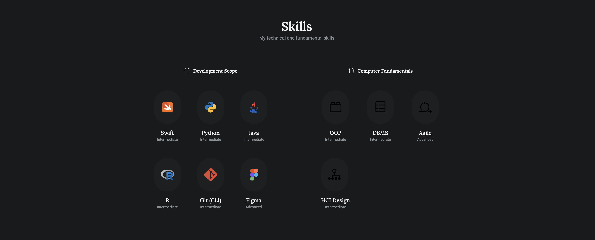
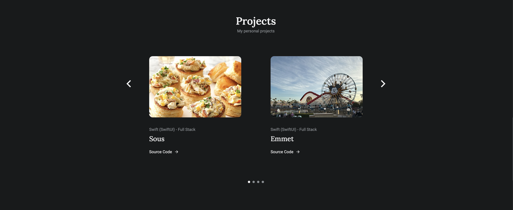

# Sileo

## Description

Built to be a personal portfolio website, Sileo is a static website that showcases my skills, qualifications, and projects I've worked on. The website is built using HTML, CSS, and JavaScript, and is hosted on Firebase. The website is responsive and mobile-friendly, and uses the Swiper library for the project carousel. 

## Technologies

- HTML 5
- CSS 3
- JavaScript
- Firebase
- ScrollReveal
- Swiper

## Screenshots

## Usage

As this is a static website, you can simply open the `index.html` file (located in `public`) in your browser to view the website.